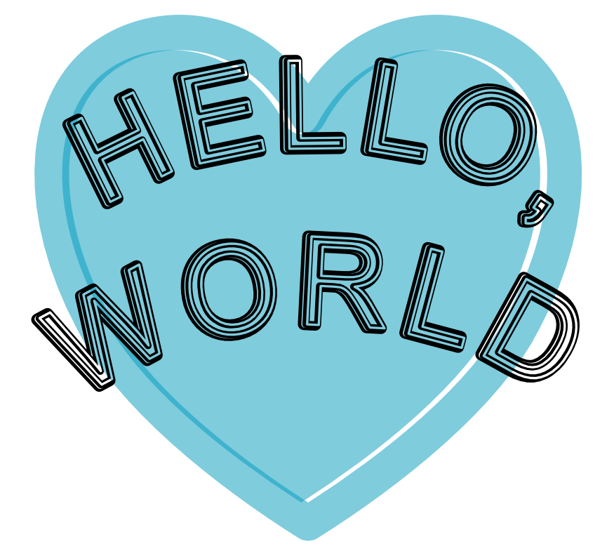
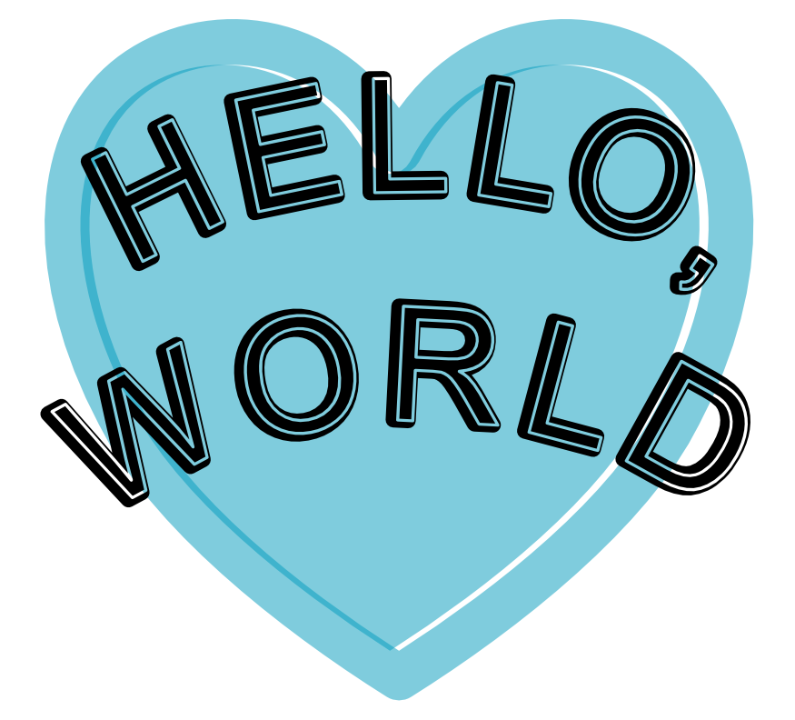
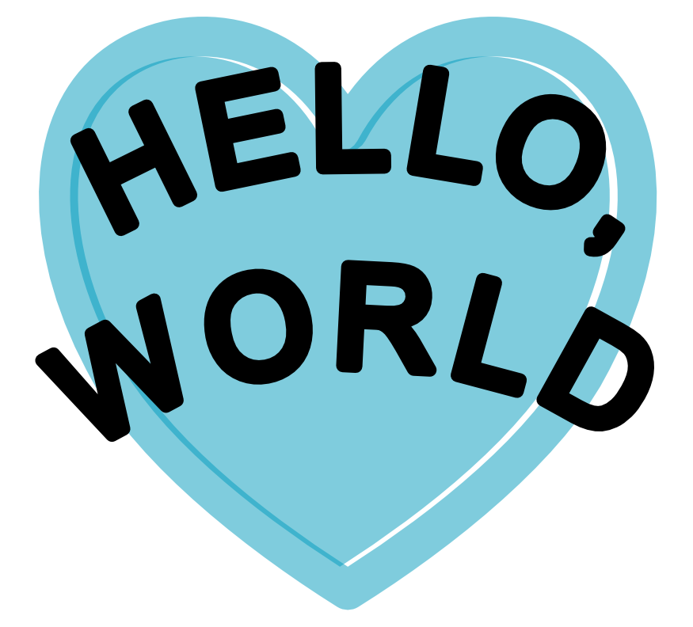
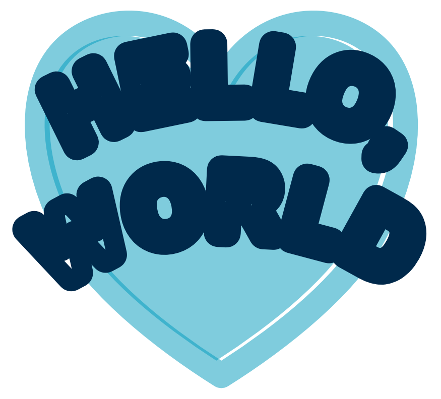
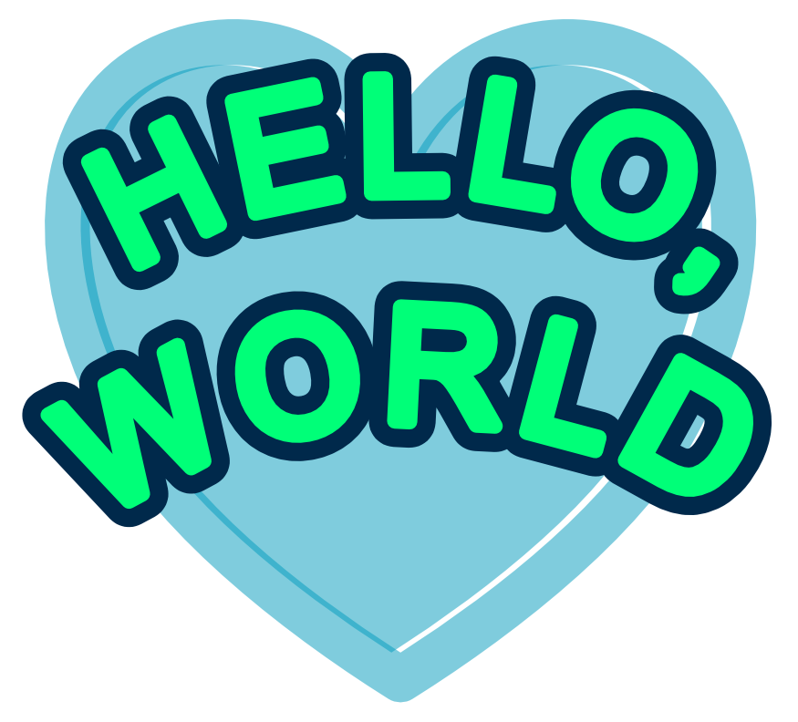
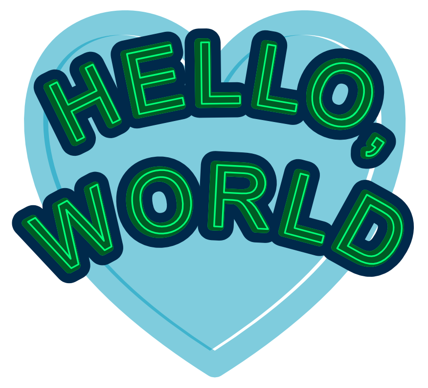
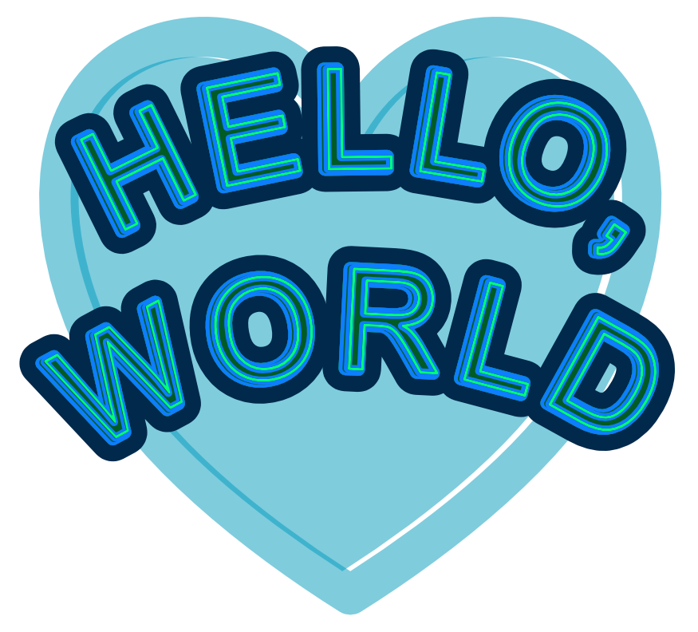
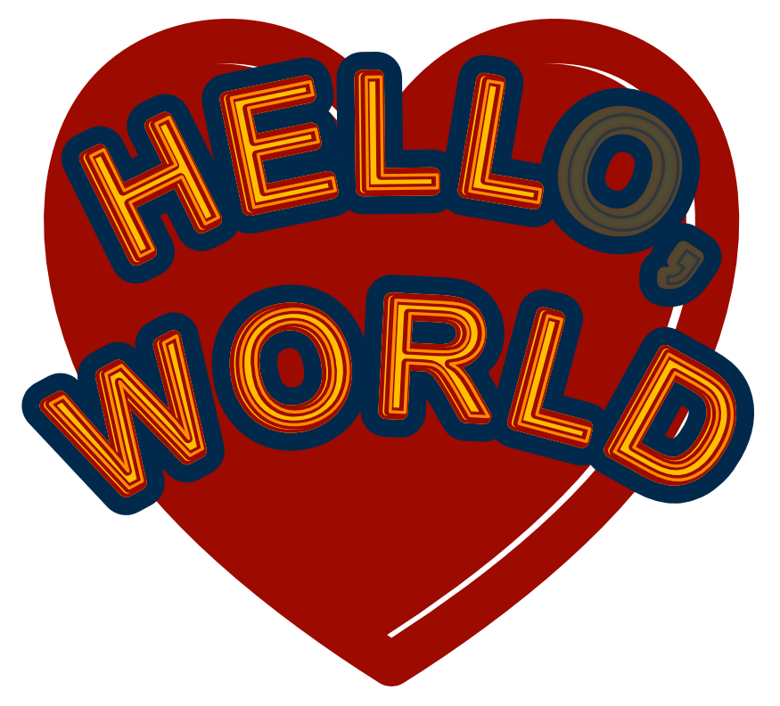

# Open Air Fonts

Please take a good look at the image above. How many special effects
would you say were needed to produce its neon-like look?

If you answered none, you were correct. All that was needed were
the three fonts from the `Open Air` font family.

Let us see what it would have looked like had we only used any one of the
three fonts alone.

First, the original `Open Air Duct` face that started it all, clearly a font
that could be used on its own:

Secondly, `Open Air Window`, which seems like just a simplified version
of the original. Indeed, that is what this font is, though it, too, could
be used on its own:

The third one, `Open Air Wall`, is the same as the above two, except it
has no openings inside the glyphs, except of course in letters such as `O`,
`a`, which are expected to have inner white space. This third font is meant
strictly as a background for either or both of the above two (though it still
may be used on its own):

## Using Overlays

While the three fonts can be used individually, we designed them specifically
to work as overlays of each other. Each corresponding glyph has identical
outline, width, left and right bearing, as well as kerning, in all three
fonts.

Let us now see how they were used to create the neon-like look in our image.
We start with `layer-0`, which is just a background, so the letters do not
seem floating in the air:

We now create the text on a path in a vector graphic editor. It does not
matter which one, though we used _Affinity Designer._ We type it using the
`Open Air Wall` font. Instead of filling it with color, we give it a fairly
thick stroke, so many of the letters seem to be overlapping. The stroke is
so thick that only the triangles in the letter `W` reveal the text has no fill.
We shall refer to it as `layer-1`:

In our vector graphic editor, we now _duplicate_ the text. We keep it in the
`Open Air Wall` typeface, but we get rid of the stroke. We fill it with the bright
neon-like color instead. This is our `layer-2`:

What we have done up to this point could be, and indeed has been, accomplished
with many other typefaces. But our `layer-3` can only be created with fonts
designed specifically for this purpose. I mean, it _could_ be done, but it
would require extra effort manipulating the text in an image editor.

But all we do here is again duplicate `layer-2` into `layer-3`, in which we
change the font into `Open Air Window` and give it a different color. This font
will cover up most of `layer-2`, letting only the neon-like part through:

We could almost stop here. But why would we when it is so easy to continue?

Once again, we duplicate `layer-3` into `layer-4`. We change the font to
`Open Air Duct` and change the fill color of this layer. This layer lets
through the same neon-like color of `layer-2` that `layer-3` let through.
It covers up most of the rest of `layer-3` but lets some fine lines through
to create a 3D-like effect. And in just a few simple steps, we have created
our final image:

You can find all three fonts right here. You can even find an SVG file with
this image, as well as a PDF file with the same image. The SVG file needs
the fonts to be installed on your system, but the PDF file has enough of the
fonts embeded, so it can be viewed on any system.

### About the fonts

I drew all the glyphs is _Affinity Designer_ and created the fonts using the
popular FontForge software. Unfortunately, I suspect FF was not made with
creating a series of synchronized fonts in mind. It was not too hard to make
the different font outlines, but kerning them identically was a major headache.

To deal with that, I had to strip all kerning from the FontForge files, export
the fonts to the [Unified Font Objects](https://unifiedfontobject.org)
format, then create a `kerning.plist` file and place it into each of the UFO
fonts, then import that to FontForge and have it create the fonts.

To make it easier to create the `kerning.plist` file, I came up with the
`jadro` language and wrote a compiler to convert a `jadro` file into a UFO
compatible `plist`. The [OpenAir.jadro](./OpenAir.jadro) is included here
for anyone who would like a different kerning for these fonts (as are the
UFO source files, so you can make your own variation of the fonts with
your own kerning).

The `jadro` compiler is available from
[https://github.com/Pantarheon/jadro](https://github.com/Pantarheon/jadro).

_G. Adam Stanislav_

